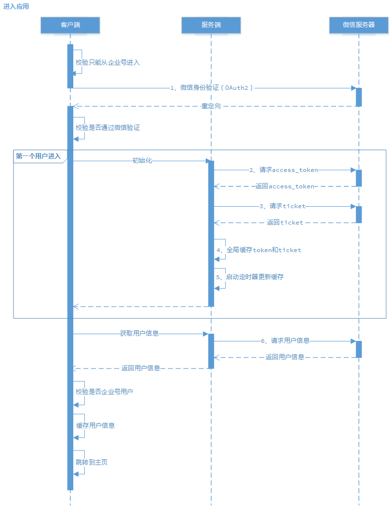
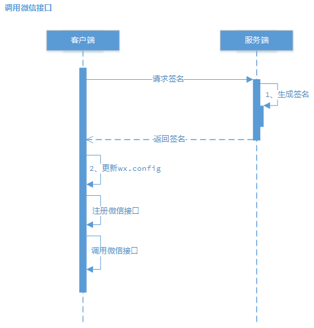
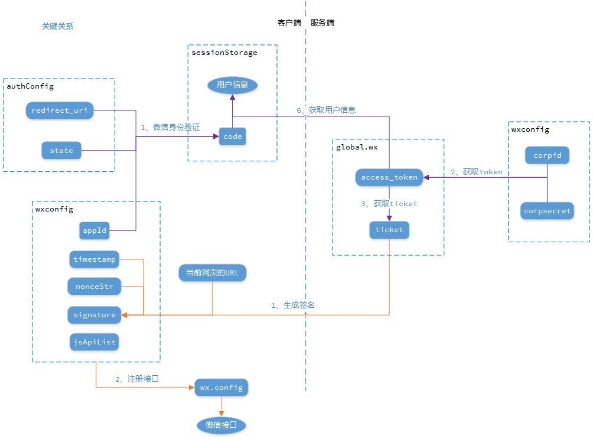

## 一些说明

> 文档、资料分享应用（目前只支持音频类资源），挂接微信企业号

> 运行前请先在以下文件填写企业号相关信息：

 * \App\src\config.js：wxconfig.appId

 * \Server\config.js：wxconfig.corpid、wxconfig.corpsecret

> 本地开发需修改默认端口号：

 * \App\config\index.js：dev.port

****

## 微信企业号应用开发入坑指南

## &sect; 热身~

 #### 1、官方文档
 * [微信企业号官网](https://qy.weixin.qq.com/)，个人开发者可以申请一个团体类型的企业号
 * [开发接口文档](http://qydev.weixin.qq.com/wiki/index.php?title=首页)，注意是企业号文档不是公众号的，虽然大同小异。
 附：[接口调试工具](http://qydev.weixin.qq.com/debug)
 * [微信web开发者工具](https://mp.weixin.qq.com/wiki/10/e5f772f4521da17fa0d7304f68b97d7e.html)，适配企业号和公众号开发

 #### 2、参考资料
 * [.Net之微信企业号开发](http://www.cnblogs.com/poplau/p/5816180.html)，学习下别人的踩坑经验
 * [微信开发工具使用教程](http://www.cnblogs.com/Leo_wl/p/5983030.html)
 * [如何保证access_token长期有效](http://www.csdn.net/article/2014-08-15/2821220-weixin)
 * [redirect_uri unauthorized错误](http://www.cnblogs.com/ywentao/p/5922822.html)

## &sect; 预备...跳！

#### 1、惯例先上图

 

 

 

#### 2、关键步骤

 * 进入应用
 
 1. 微信身份验证
    * <http://qydev.weixin.qq.com/wiki/index.php?title=身份验证>
    * 构造特定请求发送给微信服务器，含身份验证通过后的重定向url（redirect_uri）
    * 微信服务器校验身份通过后，跳转到redirect_uri，会携带一个关键参数code，用于后续获取用户信息
    * 官方文档中的“根据code获取成员信息”，在第6步才用到

 1. 请求access_token
    * 2~5步是独立的部分，可以放在应用服务端的启动时执行（我是选择在第一个用户进入应用时执行），但一定要保证在第6步前执行
    * <http://qydev.weixin.qq.com/wiki/index.php?title=主动调用>
    * 依赖corpid和corpsecret（在微信企业号后台查看<http://www.07net01.com/2015/07/871632.html>）

 1. 请求ticket
    * ticket其实与身份验证无关，它是调用JS-SDK接口前生成签名用的（我是选择随access_token一起获取后缓存）
    * <http://qydev.weixin.qq.com/wiki/index.php?title=微信JS-SDK接口>的附录1
    * 依赖access_token

 1. 全局缓存token和ticket
    * access_token和ticket是与微信接口打交道的重要凭证。由于企业号调用接口有频率限制，为了避免频繁访问微信服务器而做了全局缓存，这也是官方推荐的做法
    * 本来是想存储在session中的，但是试用了几个koa2的session中间件都觉得很麻烦（为了持久化存储需要安装额外的存储介质，比如mysql），索性直接丢在了global全局对象上

 1. 启动定时器更新缓存
    * access_token和ticket的有效期均为7200s即2小时，因此我会每(7200-5)s就请求微信服务器以获取最新值
    * 为什么-5s？提前5s请求也是为了保证这2个参数不过期

 1. 请求用户信息
    * <http://qydev.weixin.qq.com/wiki/index.php?title=OAuth验证接口>
    * 根据用户信息可以判断是否企业号成员
    * 依赖access_token和第1步的code参数

 * 调用微信接口

 1. 生成签名
    * <http://qydev.weixin.qq.com/wiki/index.php?title=微信JS-SDK接口>的附录1
    * 在上述文档的附录7有签名算法的示例代码
    * 依赖ticket

 1. 更新wx.config
    * 调用接口前，需通过wx.config注册相关信息，用于检验权限
    * vuex提供了jssdk插件，支持在vue组件内访问wx对象
    * 我测试过调用接口但失败了，应该和可信域名配置有关，暂未解决

#### 3、吐槽大会

 * 可信域名

****
****

> 指不定哪天会停用的我的企业号

